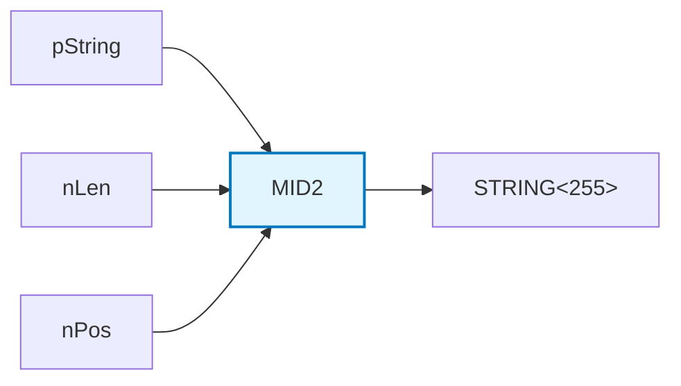
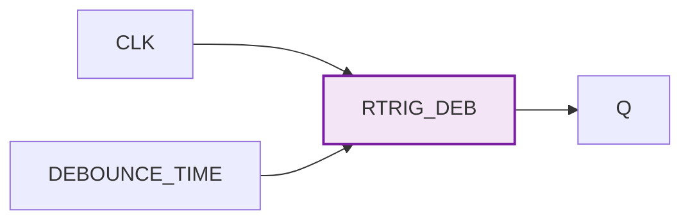

# TwinCAT Utilities

> **Note:** This is a personal project, completely separate from my work at Beckhoff. It is not an official Beckhoff product and receives no official support. I created this for my own home automation needs and decided to share it in case others find it useful.

## Table of Contents

- [MID2](#mid2---enhanced-string-extraction-function)
- [R_TRIG_DEBOUNCED](#r_trig_debounced---debounced-rising-edge-trigger)

## MID2 - Enhanced String Extraction Function

The `MID2` function is to `MID` what `FIND2` is to `FIND` - an enhanced version that works with pointer-based strings of arbitrary length. It's designed for extracting small substrings from large strings, not for extracting large strings from large strings (limited to STRING(255) output).

- Works with strings of arbitrary length via pointer access
- 1-based positioning (consistent with standard MID function)
- Safe memory operations with bounds checking
- Designed for extracting small substrings (≤255 chars) from large strings
- Handles edge cases (invalid positions, zero length, etc.)

### Function Signature

```pascal
FUNCTION MID2: STRING(255)
VAR_INPUT
    pString     : POINTER TO STRING;  // Pointer to source string
    nLen        : UDINT;              // Length of substring to extract
    nPos        : UDINT;              // Starting position (1-based)
END_VAR
```

### Usage Example

```pascal
VAR
    longString : STRING(1000) := 'This is a very long string that contains important data...';
    result     : STRING(255);
END_VAR

result := MID2(pString := ADR(longString), nLen := 10, nPos := 5);
// Result: "is a very"
```

### Dependencies

- **MID2**: Requires `Tc2_System` library for `MEMCPY` function

### Block Diagram



## R_TRIG_DEBOUNCED - Debounced Rising Edge Trigger

The `R_TRIG_DEBOUNCED` function block provides a rising edge trigger with built-in debouncing functionality, perfect for handling noisy digital inputs like mechanical switches or unreliable sensors.

- Combines rising edge detection with debouncing
- Configurable debounce time (default 200ms)
- Prevents multiple triggers during debounce period
- Clean single pulse output regardless of input noise
- Uses standard TwinCAT timer functionality

### Function Block Declaration

```pascal
FUNCTION_BLOCK R_TRIG_DEBOUNCED
VAR_INPUT
    CLK           : BOOL;                // Raw input signal
    DEBOUNCE_TIME : TIME := T#200MS;     // Debounce duration (default 200ms)
END_VAR
VAR_OUTPUT
    Q : BOOL;                            // Debounced rising edge output
END_VAR
```

### Dependencies

- **R_TRIG_DEBOUNCED**: Uses standard TwinCAT libraries (`R_TRIG`, `TON`)

### Operation

1. Detects rising edge on CLK input
2. Outputs a single pulse on Q
3. Blocks additional triggers for DEBOUNCE_TIME duration
4. Automatically resets for next trigger

### Usage Example

```pascal
VAR
    switchInput      : BOOL;          // Raw switch input
    debouncedTrigger : R_TRIG_DEBOUNCED;
    actionTriggered  : BOOL;
END_VAR

debouncedTrigger(CLK := switchInput, DEBOUNCE_TIME := T#300MS);

IF debouncedTrigger.Q THEN
    actionTriggered := TRUE;
    // Perform action only once per switch press
END_IF
```

### Block Diagram



### Timing Diagram

```mermaid
%%{init: {"theme": "base", "themeVariables": {"primaryColor": "#ffffff"}}}%%
gantt
    dateFormat X
    axisFormat %L

    section Input CLK
    Low           :done, clk1, 0, 100
    High (Noisy)  :active, clk2, 100, 200
    Low           :done, clk3, 200, 400
    High          :active, clk4, 400, 500
    Low           :done, clk5, 500, 600

    section Output Q
    Low           :done, q1, 0, 100
    Pulse         :crit, q2, 100, 110
    Low (Blocked) :done, q3, 110, 400
    Pulse         :crit, q4, 400, 410
    Low           :done, q5, 410, 600

    section Debounce
    Inactive      :done, d1, 0, 100
    Active        :active, d2, 100, 300
    Inactive      :done, d3, 300, 400
    Active        :active, d4, 400, 600
```


